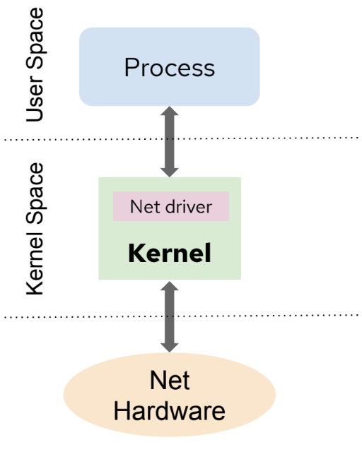
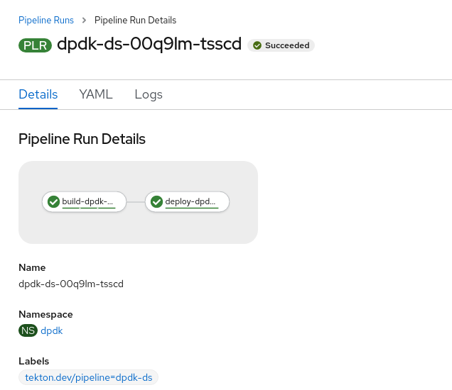

## Introduction

You've probably heard about 5G and edge computing and the potential to change the world and affect our lives. This new technology will support billions of devices with almost no latency at speeds around 20 times faster than its predecessor. Now, think about Internet of Things (IoT), Telemedicine, Augmented and Virtual Reality, Autonomous Cars, Faster Gaming finally being real... apologies for interrupting, but let's put aside for a moment our imagination and dig into the technology required to fulfill our dreams. 

All of these technologies and applications often demand very high performance requirements for both throughput, latency, and cycles-per-packet (a measure of transmission "efficiency"). This means that a compilation of multiple features are required to allow efficient utilization of the underlying platform capabilities when deploying deterministic applications. Some examples of these required network features are Multus, SR-IOV and DPDK. They are elements of what is called Containerized Network Functions (CNFs).

Before talking about CNFs, it is important to first understand Network Functions Virtualization (NFV). NFV replaces network hardware appliances with software, including virtual network functions (VNFs), that runs on virtual machines (VMs) running on commodity hardware. CNFs are like VNFs, but they run on lighter-weight containers on top of Kubernetes, providing greater agility and ease of deployment compared with VMs. While VNFs are software forms of network appliances such as routers, firewalls, load-balancers, etc. deployed as one or more VMs, CNFs are just the containerized network functions, which increases portability—not the entire OS. 

In a generic Kubernetes application, the single networking interface provided by a POD (eth0) is sufficient for most purposes. It even can be extended using CNI plugins available. However, in cases where low latency and high network performance is a must, we need a way of providing additional network interfaces to the POD which has direct access to the hardware (NIC). Therefore, our application can communicate with the hardware which delivers this high capacities outside of the standard Kubernetes networking. This is why we start talking about CNFs and ways to accelerate them.

In the OpenShift blog we already presented and "demystified" [Multus](https://www.openshift.com/blog/demystifying-multus) and their deep relation with SR-IOV technology when dealing with high performance networking workloads. Basically, Multus will allow our application to attach to a virtual function (VF) interface on SR-IOV capable hardware on the Kubernetes node. This will permit us to achieve near-native networking performance. The [SR-IOV Operator](https://docs.openshift.com/container-platform/4.5/networking/hardware_networks/installing-sriov-operator.html) became GA on OpenShift 4.3, so information on how to install and configure it can be found in the official documentation.


In this blog post we are going to focus on a Technology Preview feature in OpenShift 4.5 called Data Plane Development Kit (DPDK). [DPDK](https://www.dpdk.org/) is a set of libraries and drivers for Linux and BSD built to accelerate packet processing workloads designed to run on x86, POWER and ARM processors. DPDK offers offloading TCP packet processing from the operating system Kernel space to process them in the User space to obtain a high performant and deterministic system. DPDK libraries offer avoiding as much as possible kernel interrupts by skipping the Kernel space moving from the usual data flow:



To run as shown in this diagram below. Using the User space thanks to DPDK libraries and the DPDK poll mode driver (PMD), who is responsible for the communication between the application and network card, listening in a loop avoiding as much as possible interrupts while forwarding packets.


In OpenShift 4.5, as Technology Preview, it is possible to use DPDK libraries and attach the network interface directly to the POD (SR-IOV virtual function). Therefore, DPDK will be skipping the use of the Kernel space in both the POD and the Worker node Operating System. In this blog post we are going to show how to leverage Red Hat's DPDK builder image available from Red Hat's official registry (registry.redhat.io/openshift4/dpdk-base-rhel8) to build applications powered by DPDK. In this task, an automated process (pipeline) driven by Cloud-native CI/CD on OpenShift called OpenShift Pipelines will assist us.


## Environment

* An OpenShift Container Platform 4.5 cluster
* [OpenShift Pipelines](https://www.openshift.com/learn/topics/pipelines) based on [Tekton](https://tekton.dev/) instellad as the CI/CD tool. It is available to install from OpenShift's OperatorHub.
* Demo files:
  ** [Demo Repository](https://github.com/alosadagrande/tekton-dpdk)
  ** Tekton Files

Whether you are going to also deploy the built application, you will require at least:

* A SR-IOV capable Node inside the OpenShift cluster. In our case we have a worker Node with several Mellanox MT27800 Family [ConnectX-5] 25GbE dual-port SFP28 Network Interface Cards (NICs). Take a look at [this table](https://docs.openshift.com/container-platform/4.5/networking/hardware_networks/about-sriov.html) with all the supported SR-IOV NIC models.
* [SR-IOV Nework operator](https://docs.openshift.com/container-platform/4.5/networking/hardware_networks/installing-sriov-operator.html) must be installed and running successfully. SR-IOV devices must be properly detected and configured.
* DPDK requires huge pages to be configured within the Node where the application is deployed. A detailed procedure can be found in [Configuring huge pages](https://docs.openshift.com/container-platform/4.5/scalability_and_performance/what-huge-pages-do-and-how-they-are-consumed-by-apps.html).

**NOTE:** If you do not have an SR-IOV supported device, you still can run the OpenShift pipeline and build the example DPDK application. 

## Scenario


This repository contains information on how to build a DPDK application using [OpenShift Pipelines](https://www.openshift.com/learn/topics/pipelines) based on [Tekton](https://tekton.dev/). The target is to create a pipeline that allow us to build and deploy a DPDK application. In this example, we are going to install [testPMD](https://doc.dpdk.org/guides/testpmd_app_ug/), which is an application that can be used to test the DPDK in a packet forwarding mode and also to access NIC hardware features such as Flow Director. [Pktgen](https://pktgen-dpdk.readthedocs.io/en/latest/) is another example of a DPDK application that can be build.

> :exclamation: In this case testPMD serves as an example of how to build a more fully-featured application using the DPDK SDK.

Finally, we are going to create two pipelines to deploy testPMD on **upstream** and **downstream** DPDK base images.

## 1. Requirements

First, you need to be aware than DPDK requires HugePages to be configured (along with the SR-IOV configuration) so it would be a good idea to take a look to the last post about HugePages

- A SR-IOV capable server
- SR-IOV network operator must be installed and running successfully. SR-IOV devices must be proper detected

Information on how to deploy SR-IOV operator on OpenShift can be found in [field_enablement folder](https://gitlab.cee.redhat.com/sysdeseng/cnf-integration/-/tree/master/field_enablement/sriov) in this same repository

More detailed information on how to set up SR-IOV devices can be found in the [performance-operatos-lab](https://performance-operators-lab.readthedocs.io/en/latest/#sr-iov-operator)


## 2. Build a DPDK application

Two pipelines to deploy testPMD are going to be created:

1. This pipeline is based on the **downstream** DPDK base image which is running DPDK version 18.11.2 by default. This [DPDK RHEL8 base image](https://catalog.redhat.com/software/containers/openshift4/dpdk-base-rhel8/5e32be6cdd19c77896004a41?container-tabs=overview) is already built and maintained by Red Hat and based on UBI 8.

> :exclamation: The [Dockerfile](https://catalog.redhat.com/software/containers/openshift4/dpdk-base-rhel8/5e32be6cdd19c77896004a41?container-tabs=dockerfile) published can be modified to run DPDK version 19.x by replacing DPDK_VER env.

2. This second pipeline is based on the **upstream** effort to deploy testPMD on top of a CentOS 7 base image. In the [cnf-features-deploy](https://github.com/openshift-kni/cnf-features-deploy/tree/master/tools/s2i-dpdk) repository can be found detailed information. This pipeline requires to build testPMD image from a [Dockerfile](https://github.com/openshift-kni/cnf-features-deploy/blob/master/tools/s2i-dpdk/Dockerfile)

### 2.1. DPDK RHEL 8 base image

Since we already have a base image with DPDK installed, we are just going to deploy testPMD on top of it using the **S2i** feature. Tekton comes with default with a bunch of clusterTasks predefined. One of them is the S2i Task.

First, let's create the imageStream where the built image will be managed.

```sh
$ oc create -f is-ds.yaml 
imagestream.image.openshift.io/rhel8-dpdk-app created
```

Next, create the deploymentConfig of our application. In this case we are going to disable the automatic rollout when there is a new image pushed to the application's imageStream because we want our pipeline to do that:

```sh
$ oc create -f pipeline-dpdk/deployment-config-ds.yaml
deploymentconfig.apps.openshift.io/rhel8-dpdk-testpmd created
```

```sh
$ oc set triggers dc rhel8-dpdk-testpmd
NAME                                  TYPE    VALUE                                       AUTO
deploymentconfigs/rhel8-dpdk-testpmd  config                                              true
deploymentconfigs/rhel8-dpdk-testpmd  image   rhel8-dpdk-app:tekton (rhel8-dpdk-testpmd)  false
```

Since the Red Hat registry requires authentication to pull the DPDKD base image, a docker-registry secrets needs to be created and assigned to the pipeline serviceAccount:

```sh
oc create secret docker-registry redhat-registry-secret --docker-server=registry.redhat.io --docker-username=alosadag --docker-password=myP455 
oc secret link pipeline redhat-registry-secret
```


Then, it is time install the pipelineResources. Below it is shown the input Git resource where it is defined the repository annd revision of the application. 


```sh
$ oc create -f pipeline-dpdk/pipeline-resource-git.yaml
pipelineresource.tekton.dev/git-cnf-features-deploy created
```

Next, we create the output resource that indicates where the built image needs to be pushed.

```sh
$ oc create -f pipeline-dpdk/pipeline-resource-image-ds.yaml
pipelineresource.tekton.dev/image-push-rhel8-dpdk-app created
```

Finally, the Pipeline is created. It contains the tasks defined and the both the input and output resources. Tasks are basically two: build the testPMD application on top of the DPDK RHEL 8 base image and second deploy the application in the cluster:

```sh
$ oc create -f pipeline-dpdk/pipeline-dpdk-ds.yaml 
pipeline.tekton.dev/dpdk-ds created
```

Here a description of the dpdk-ds Pipeline composed by the two Tasks previously explained:

```sh
$ tkn pipeline describe dpdk-ds
Name:        dpdk-ds
Namespace:   dpdk

📦 Resources

 NAME                          TYPE
 ∙ git-cnf-features-deploy     git
 ∙ image-push-rhel8-dpdk-app   image

⚓ Params

 NAME           TYPE     DESCRIPTION   DEFAULT VALUE
 ∙ contextDir   string                 tools/s2i-dpdk/test/test-app
 ∙ TLSVERIFY    string                 false

🗒  Tasks

 NAME                TASKREF            RUNAFTER
 ∙ build-dpdk-app    s2i                
 ∙ deploy-dpdk-app   openshift-client   build-dpdk-app

⛩  PipelineRuns

 No pipelineruns
```

Now, it is time to run the pipeline. This can be done from the tkn binary, OCP web console or using the [vscode Tekton extension](https://github.com/redhat-developer/vscode-tekton).

```sh
$ tkn p start dpdk-ds -r git-cnf-features-deploy=git-cnf-features-deploy -r image-push-rhel8-dpdk-app=image-push-rhel8-dpdk-app --use-param-defaults
Pipelinerun started: dpdk-ds-run-7kg6g
```

Pipelin logs can be seen using tkn binary:

```sh
$ tkn pipelinerun logs dpdk-ds-run-7kg6g -f -n dpdk

[build-dpdk-app : git-source-git-cnf-features-deploy-6xjqp] {"level":"info","ts":1593683406.534047,"caller":"git/git.go:105","msg":"Successfully cloned https://github.com/openshift-kni/cnf-features-deploy.git @ release-4.4 in path /workspace/source"}
[build-dpdk-app : git-source-git-cnf-features-deploy-6xjqp] {"level":"warn","ts":1593683406.5342803,"caller":"git/git.go:152","msg":"Unexpected error: creating symlink: symlink /tekton/home/.ssh /root/.ssh: file exists"}
[build-dpdk-app : git-source-git-cnf-features-deploy-6xjqp] {"level":"info","ts":1593683406.7380693,"caller":"git/git.go:133","msg":"Successfully initialized and updated submodules in path /workspace/source"}

[build-dpdk-app : generate] Application dockerfile generated in /gen-source/Dockerfile.gen

[build-dpdk-app : build] STEP 1: FROM registry.redhat.io/openshift4/dpdk-base-rhel8
[build-dpdk-app : build] Getting image source signatures
[build-dpdk-app : build] Copying blob sha256:1a6747857d791055aacb2d5c8694fe405d7824c742a4e049737eafa8f840bf23
[build-dpdk-app : build] Copying blob sha256:fc5aa93e3b58a9290f9ec203610784562c3f9831c969a1fcdc453633e89e4bea
[build-dpdk-app : build] Copying blob sha256:57fc5d6704ccf8d71f760282e1effc88f53cb5e3a176a23e926bf2912b498ad5
[build-dpdk-app : build] Copying config sha256:28c2a18c0aa8183454d0dd41a98b7eafa7f01bee60d9100f3a64482968dc7adb
[build-dpdk-app : build] Writing manifest to image destination
[build-dpdk-app : build] Storing signatures
[build-dpdk-app : build] STEP 2: LABEL "io.openshift.s2i.build.image"="registry.redhat.io/openshift4/dpdk-base-rhel8"       "io.openshift.s2i.build.source-location"="tools/s2i-dpdk/test/test-app"
[build-dpdk-app : build] 37d3b1777f7e4e77c3ba0ab7408da1233327c3b691280d636b2d6919eb4f3d4e
[build-dpdk-app : build] STEP 3: USER root
[build-dpdk-app : build] 585c37427eff8d9fc33a514eecb6fe95a6a0d7e04f41e942ba72c9008b111549
[build-dpdk-app : build] STEP 4: COPY upload/src /tmp/src
[build-dpdk-app : build] 567a879ee509f175d23d9630aea7c77ea8d150caaff70ef4092a5e9843a95b76
[build-dpdk-app : build] STEP 5: RUN chown -R 1001:0 /tmp/src
[build-dpdk-app : build] 7edeb2010758d51af2b2b20bb846855d1abb6c0646f9a44ac73d6c324d520c63
[build-dpdk-app : build] STEP 6: USER 1001
[build-dpdk-app : build] c5f3be9e7f2cc8b8a36eecf9dc0803a41fdedb5e9975e1f5ef7d328abff9eb0c
[build-dpdk-app : build] STEP 7: RUN /usr/libexec/s2i/assemble
[build-dpdk-app : build] ---> Installing application source...
[build-dpdk-app : build] ---> Building application from source...
[build-dpdk-app : build] make: Entering directory '/opt/app-root/src/test-pmd'
[build-dpdk-app : build]   CC testpmd.o
[build-dpdk-app : build]   CC parameters.o
[build-dpdk-app : build]   CC cmdline.o
[build-dpdk-app : build]   CC cmdline_flow.o
[build-dpdk-app : build]   CC cmdline_mtr.o
[build-dpdk-app : build]   CC cmdline_tm.o
[build-dpdk-app : build]   CC config.o
[build-dpdk-app : build]   CC iofwd.o
[build-dpdk-app : build]   CC macfwd.o
[build-dpdk-app : build]   CC macswap.o
[build-dpdk-app : build]   CC flowgen.o
[build-dpdk-app : build]   CC rxonly.o
[build-dpdk-app : build]   CC txonly.o
[build-dpdk-app : build]   CC csumonly.o
[build-dpdk-app : build]   CC icmpecho.o
[build-dpdk-app : build]   CC noisy_vnf.o
[build-dpdk-app : build]   CC util.o
[build-dpdk-app : build]   LD testpmd
[build-dpdk-app : build]   INSTALL-APP testpmd
[build-dpdk-app : build]   INSTALL-MAP testpmd.map
[build-dpdk-app : build] make: Leaving directory '/opt/app-root/src/test-pmd'
[build-dpdk-app : build] build done
[build-dpdk-app : build] 0934898fc3c3613cfbd8852cad631cf4a74e385fe299f9896936b03cbf32c480
[build-dpdk-app : build] STEP 8: CMD /usr/libexec/s2i/run
[build-dpdk-app : build] STEP 9: COMMIT image-registry.openshift-image-registry.svc:5000/dpdk/rhel8-dpdk-app:tekton
[build-dpdk-app : build] 8d412bcb87749bcd6a8698ca9b4aaf96fb2c0f8a7073b312e3d9c18943c1548d
[build-dpdk-app : build] 8d412bcb87749bcd6a8698ca9b4aaf96fb2c0f8a7073b312e3d9c18943c1548d

[build-dpdk-app : push] Getting image source signatures
[build-dpdk-app : push] Copying blob sha256:197abfc41d40e7c450efa8d8a86a72370cd2a70718476b8a5289f599c4653f64
[build-dpdk-app : push] Copying blob sha256:173e6a5d113caa638bbc87c13000b4904b9a6443554275ff9e13c31328618f6e
[build-dpdk-app : push] Copying blob sha256:368c061025d47dcd1c059165eabdc95717ab74bf70762da3fc73827d6403e0a8
[build-dpdk-app : push] Copying blob sha256:63d19bfaf5ccc585a75c5b0fcca3b6701d4b3f268b2007b1030d9f04be7c77db
[build-dpdk-app : push] Copying blob sha256:4470541faea704a1f117401aea3e0397309e590a0513c856be118cc83102b046
[build-dpdk-app : push] Copying blob sha256:f8ae5e656ae0a6fcbb9510d51979f0c49df9a235e82a57ff6ce5ad03365fb063
[build-dpdk-app : push] Copying config sha256:8d412bcb87749bcd6a8698ca9b4aaf96fb2c0f8a7073b312e3d9c18943c1548d
[build-dpdk-app : push] Writing manifest to image destination
[build-dpdk-app : push] Copying config sha256:8d412bcb87749bcd6a8698ca9b4aaf96fb2c0f8a7073b312e3d9c18943c1548d
[build-dpdk-app : push] Writing manifest to image destination
[build-dpdk-app : push] Storing signatures

[build-dpdk-app : image-digest-exporter-kh6c9] {"level":"info","ts":1593683474.667242,"logger":"fallback-logger","caller":"logging/config.go:76","msg":"Fetch GitHub commit ID from kodata failed: \"KO_DATA_PATH\" does not exist or is empty"}
[build-dpdk-app : image-digest-exporter-kh6c9] {"level":"info","ts":1593683474.667554,"logger":"fallback-logger","caller":"imagedigestexporter/main.go:59","msg":"No index.json found for: image-push-rhel8-dpdk-app"}

[deploy-dpdk-app : oc] + oc rollout latest dc/rhel8-dpdk-testpmd
[deploy-dpdk-app : oc] deploymentconfig.apps.openshift.io/rhel8-dpdk-testpmd rolled out
```


Finally, verify that the testPMD POD is deployed successfully:

```sh
$ oc get pods -L app=rhel8-dpdk-testpmd
NAME                                                READY   STATUS      RESTARTS   AGE    APP=RHEL8-DPDK-TESTPMD
rhel8-dpdk-testpmd-1-deploy                         0/1     Completed   0          86s    
rhel8-dpdk-testpmd-1-lvcql                          1/1     Running     0          81s    

$ oc describe pod rhel8-dpdk-testpmd-1-lvcql | grep -i Image:
    Image:         image-registry.openshift-image-registry.svc:5000/dpdk/rhel8-dpdk-app@sha256:355249f051355fd1c23ac17f5e67392650a6bf7e7efa7c768baf1eac0cf3d236

$ oc get is rhel8-dpdk-app
NAME              IMAGE REPOSITORY                                                        TAGS     UPDATED
rhel8-dpdk-app    image-registry.openshift-image-registry.svc:5000/dpdk/rhel8-dpdk-app    tekton   4 minutes ago

$ oc describe is rhel8-dpdk-app 
Name:			rhel8-dpdk-app
Namespace:		dpdk
Created:		About an hour ago
Labels:			<none>
Annotations:		<none>
Image Repository:	image-registry.openshift-image-registry.svc:5000/dpdk/rhel8-dpdk-app
Image Lookup:		local=false
Unique Images:		1
Tags:			1

tekton
  no spec tag

  * image-registry.openshift-image-registry.svc:5000/dpdk/rhel8-dpdk-app@sha256:355249f051355fd1c23ac17f5e67392650a6bf7e7efa7c768baf1eac0cf3d236
```




### 2.2. DPDK CentOS base image

In this example the testPMD application is going to be built from a CentOS 7 image. This means, that both DPDK and testPMD needs to be installed. In order to do that, our build strategy will be using the following [Dockerfile](https://github.com/openshift-kni/cnf-features-deploy/blob/master/tools/s2i-dpdk/Dockerfile).

> :exclamation: In this case, instead of using the S2i clusterTask we are going to use the buildah clusterTask which will process the Dockerfile, create the container image and push it to the internal OpenShift registry.


First, let's create the imageStream where the built image will be managed.

```sh
$ oc create -f is-us.yaml 
imagestream.image.openshift.io/centos-dpdk-app created
```

Next, create the deploymentConfig of our application. In this case we are going to disable the automatic rollout when there is a new image pushed to the application's imageStream because we want our pipeline to do that:

```sh
$ oc create -f pipeline-dpdk/deployment-config-us.yml 
deploymentconfig.apps.openshift.io/centos-dpdk-testpmd created
```

```sh
$ oc set triggers dc centos-dpdk-testpmd
NAME                                   TYPE    VALUE                                         AUTO
deploymentconfigs/centos-dpdk-testpmd  config                                                true
deploymentconfigs/centos-dpdk-testpmd  image   centos-dpdk-app:tekton (centos-dpdk-testpmd)  false
```

> :exclamation: pipelineResource pipeline-resource-git.yaml should be already installed if [2.1. DPDK RHEL 8 base image](#21-dpdk-rhel-8-base-image) was followed. Otherwise must be installed.


The output resource that indicates where the built image needs to be pushed is created below.

```sh
$ oc create -f pipeline-dpdk/pipeline-resource-image-us.yaml 
pipelineresource.tekton.dev/image-push-centos-dpdk-app created
```

The following resources must be shown in Tekton or at least the previous two described in this section:

```sh
$ tkn resources list
NAME                         TYPE    DETAILS
git-cnf-features-deploy      git     url: https://github.com/openshift-kni/cnf-features-deploy.git
image-push-centos-dpdk-app   image   url: image-registry.openshift-image-registry.svc:5000/dpdk/centos-dpdk-app:tekton
image-push-rhel8-dpdk-app    image   url: image-registry.openshift-image-registry.svc:5000/d
```

Finally create the Pipeline. It contains the tasks defined and both the input and output resources. Tasks are basically two: build the testPMD application on top of a CentOS base image using a Dockerfile strategy and second deploy the application in the cluster:

```sh
$ oc create -f pipeline-dpdk/pipeline-dpdk-us.yaml 
pipeline.tekton.dev/dpdk-us created
```

Here a description of the dpdk-ds Pipeline composed by the two Tasks previously explained:

```sh
$ tkn pipeline describe dpdk-us
Name:        dpdk-us
Namespace:   dpdk

📦 Resources

 NAME                           TYPE
 ∙ git-cnf-features-deploy      git
 ∙ image-push-centos-dpdk-app   image

⚓ Params

 No params

🗒  Tasks

 NAME                TASKREF            RUNAFTER
 ∙ build-dpdk-app    buildah            
 ∙ deploy-dpdk-app   openshift-client   build-dpdk-app

⛩  PipelineRuns

 No pipelineruns
```

Now, it is time to run the pipeline. This can be done from the tkn binary, OCP web console or using the [vscode Tekton extension](https://github.com/redhat-developer/vscode-tekton).

```sh
$ tkn p start dpdk-us -r git-cnf-features-deploy=git-cnf-features-deploy -r image-push-centos-dpdk-app=image-push-centos-dpdk-app --use-param-defaults
Pipelinerun started: dpdk-us-run-2bx55

```
> :warning:  It is possible to take a look at the logs while executing the pipeline. However, take into account that this pipelinerun takes about 25 minutes to complete.

```sh
$ tkn pipelinerun logs dpdk-us-run-2bx55 -f -n dpdk

[build-dpdk-app : git-source-git-cnf-features-deploy-ws2kr] {"level":"info","ts":1593683304.3594043,"caller":"git/git.go:105","msg":"Successfully cloned https://github.com/openshift-kni/cnf-features-deploy.git @ release-4.4 in path /workspace/source"}
[build-dpdk-app : git-source-git-cnf-features-deploy-ws2kr] {"level":"warn","ts":1593683304.3596091,"caller":"git/git.go:152","msg":"Unexpected error: creating symlink: symlink /tekton/home/.ssh /root/.ssh: file exists"}
[build-dpdk-app : git-source-git-cnf-features-deploy-ws2kr] {"level":"info","ts":1593683304.5647552,"caller":"git/git.go:133","msg":"Successfully initialized and updated submodules in path /workspace/source"}

[build-dpdk-app : build] STEP 1: FROM openshift/base-centos7
[build-dpdk-app : build] Getting image source signatures
[build-dpdk-app : build] Copying blob sha256:a3ed95caeb02ffe68cdd9fd84406680ae93d633cb16422d00e8a7c22955b46d4
[build-dpdk-app : build] Copying blob sha256:a3ed95caeb02ffe68cdd9fd84406680ae93d633cb16422d00e8a7c22955b46d4
[build-dpdk-app : build] Copying blob sha256:a3ed95caeb02ffe68cdd9fd84406680ae93d633cb16422d00e8a7c22955b46d4
[build-dpdk-app : build] Copying blob sha256:a3ed95caeb02ffe68cdd9fd84406680ae93d633cb16422d00e8a7c22955b46d4
[build-dpdk-app : build] Copying blob sha256:a3ed95caeb02ffe68cdd9fd84406680ae93d633cb16422d00e8a7c22955b46d4
[build-dpdk-app : build] Copying blob sha256:45a2e645736c4c66ef34acce2407ded21f7a9b231199d3b92d6c9776df264729
[build-dpdk-app : build] Copying blob sha256:a3ed95caeb02ffe68cdd9fd84406680ae93d633cb16422d00e8a7c22955b46d4
[build-dpdk-app : build] Copying blob sha256:a3ed95caeb02ffe68cdd9fd84406680ae93d633cb16422d00e8a7c22955b46d4
[build-dpdk-app : build] Copying blob sha256:a3ed95caeb02ffe68cdd9fd84406680ae93d633cb16422d00e8a7c22955b46d4
[build-dpdk-app : build] Copying blob sha256:a3ed95caeb02ffe68cdd9fd84406680ae93d633cb16422d00e8a7c22955b46d4
[build-dpdk-app : build] Copying blob sha256:a3ed95caeb02ffe68cdd9fd84406680ae93d633cb16422d00e8a7c22955b46d4
[build-dpdk-app : build] Copying blob sha256:a3ed95caeb02ffe68cdd9fd84406680ae93d633cb16422d00e8a7c22955b46d4
[build-dpdk-app : build] Copying blob sha256:8a3400b7e31a55323583e3d585b3b0be56d9f7ae563187aec96d47ef5419982a
[build-dpdk-app : build] Copying blob sha256:78efc9e155c4f5ac3665c4ef14339c305672468520dc0d5ad5a254ce90a1ec28
[build-dpdk-app : build] Copying blob sha256:734fb161cf896cf5c25a9a857a4b4d267bb5a59d5acf9ba846278ab3f3d1f5d5
[build-dpdk-app : build] Writing manifest to image destination
[build-dpdk-app : build] Storing signatures
....
```

```sh
$ tkn pr ls dpdk-us
NAME                STARTED          DURATION     STATUS
dpdk-us-run-2bx55   52 minutes ago   41 minutes   Succeeded
```

Finally, check that the testPMD has been deployed:

```sh
$ oc get pods -o wide -ldeployment=centos-dpdk-testpmd-1$ 

NAME                          READY   STATUS    RESTARTS   AGE     IP            NODE                                             NOMINATED NODE   READINESS GATES
centos-dpdk-testpmd-1-w4xfj   1/1     Running   0          9m33s   10.135.0.17   cnf12-worker-0.dev5.kni.lab.eng.bos.redhat.com   <none>           <none>

$ oc rsh centos-dpdk-testpmd-1-w4xfj testpmd -v
EAL: Detected 80 lcore(s)
EAL: Detected 2 NUMA nodes
EAL: RTE Version: 'DPDK 18.11.0'
EAL: Multi-process socket /var/run/dpdk/rte/mp_socket
EAL: No free hugepages reported in hugepages-1048576kB
...
```

## Notes

* A suggested read about SR-IOV, DPDK and CNF in general from Red Hatter Luis Arizmendi can be found in [Medium](https://medium.com/swlh/enhanced-platform-awareness-epa-in-openshift-part-iv-sr-iov-dpdk-and-rdma-1cc894c4b7d0)
* Information how to configured DPDK can be found in the [performance-operators-lab](https://performance-operators-lab.readthedocs.io/en/latest/#dpdk-s2i) and in the [field_enablement folder](https://gitlab.cee.redhat.com/sysdeseng/cnf-integration/-/tree/master/field_enablement/dpdk)