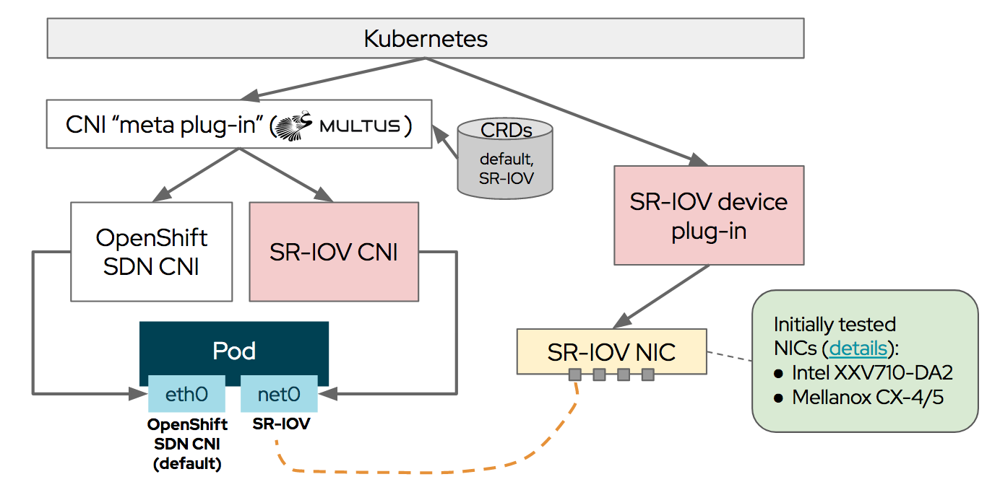
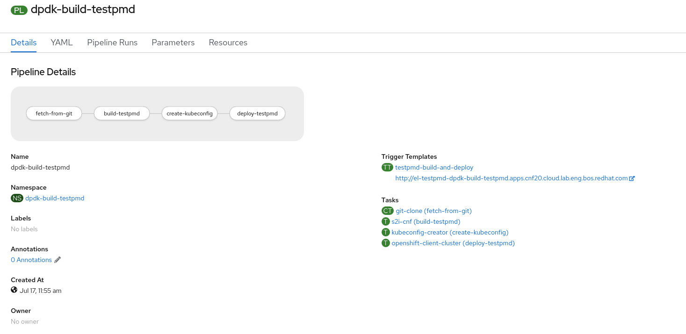

# Introduction

You've probably heard about 5G and edge computing and the potential to change the world and affect our lives. This new technology will support billions of devices with almost no latency at speeds around 20 times faster than its predecessor. Now, think about Internet of Things (IoT), Telemedicine, Augmented and Virtual Reality, Autonomous Cars, Faster Gaming finally being real... apologies for interrupting, but let's put aside for a moment our imagination and dig into the technology required to fulfill our dreams. 

All of these technologies and applications often demand very high performance requirements for both throughput, latency, and cycles-per-packet (a measure of transmission "efficiency"). This means that a compilation of multiple features are required to allow efficient utilization of the underlying platform capabilities when deploying deterministic applications. Some examples of these required network features are Multus, SR-IOV and DPDK. They are elements of what is called Containerized Network Functions or Cloud native Network Functions (CNFs).

## Containerized Network Functions

Before talking about CNFs, it is important to first understand Network Functions Virtualization (NFV). NFV replaces network hardware appliances with software, including virtual network functions (VNFs), that runs on virtual machines (VMs) running on commodity hardware. CNFs are like VNFs, but they run on lighter-weight containers on top of Kubernetes, providing greater agility and ease of deployment compared with VMs. While VNFs are software forms of network appliances such as routers, firewalls, load-balancers, etc. deployed as one or more VMs, CNFs are just the containerized network functions, which increases portability—not the entire OS. 

In a generic Kubernetes application, the single networking interface provided by a POD (eth0) is sufficient for most purposes. It even can be extended using CNI plugins available. However, in cases where low latency and high network performance is a must, we need a way of providing additional network interfaces to the POD which has direct access to the hardware (NIC). Therefore, our application can communicate with the hardware which delivers this high capacities outside of the standard Kubernetes networking. This is why we start talking about CNFs and ways to accelerate them.

In the OpenShift blog we already presented and "demystified" [Multus](https://www.openshift.com/blog/demystifying-multus) and their deep relation with SR-IOV technology when dealing with high performance networking workloads. Basically, Multus will allow our application to attach to a virtual function (VF) interface on SR-IOV capable hardware on the Kubernetes node. This will permit us to achieve near-native networking performance. The [SR-IOV Operator](https://docs.openshift.com/container-platform/4.5/networking/hardware_networks/installing-sriov-operator.html) became GA on OpenShift 4.3, so information on how to install and configure it can be found in the official documentation.



In this blog post we are going to focus on a Technology Preview feature in OpenShift 4.5 called Data Plane Development Kit (DPDK). [DPDK](https://www.dpdk.org/) is a set of libraries and drivers for Linux and BSD built to accelerate packet processing workloads designed to run on x86, POWER and ARM processors. DPDK offers offloading TCP packet processing from the operating system Kernel space to process them in the User space to obtain a high performant and deterministic system. 

DPDK libraries offer avoiding as much as possible kernel interrupts by skipping the Kernel space and  move the User space instead. This is possible thanks to DPDK libraries and the DPDK poll mode driver (PMD), who is responsible for the communication between the application and network card, listening in a loop avoiding as much as possible interrupts while forwarding packets. That can be shown in this diagram below:


In OpenShift 4.5, as Technology Preview, it is possible to use DPDK libraries and attach the network interface directly to the POD (SR-IOV virtual function). Therefore, DPDK will be skipping the use of the Kernel space in both the POD and the Worker node Operating System. 

# Scenario

In this blog post we are going to show how to leverage Red Hat's [DPDK builder image](registry.redhat.io/openshift4/dpdk-base-rhel8) available from Red Hat's official registry to build applications powered by DPDK. In this task, a continuous deployment process (pipeline) driven by Cloud-native CI/CD on OpenShift called OpenShift Pipelines will assist us. The goal is to create a pipeline that allow us to get the code, build and deploy a DPDK application. In this example, we are going to install [testPMD](https://doc.dpdk.org/guides/testpmd_app_ug/), which is an application that can be used to test the DPDK in a packet forwarding mode and also to access NIC hardware features such as Flow Director. 

> :exclamation: In this case testPMD serves as an example of how to build a more fully-featured application using the DPDK base image.


PIPELINE DIAGRAM TO BE CREATED 

The pipeline which will be in charge of:

* Starting the pipeline everytime code is pushed into the master branch of the testPMD Git repository.
* Pulling the DPDK base image from Red Hat's registry.
* Pulling testPMD application source code and source-to-image (s2i) scripts from a Git repository. Those scripts describe how our application must be built. 
* Pushing the output image of this process into a public registry such as quay.io. 
* Deploying the new version of the application into the proper project running in another cluster, the CNF OpenShift cluster.

**NOTE:** At the time of writing DPDK base image is running DPDK version 18.11.2. This [DPDK RHEL8 base image](https://catalog.redhat.com/software/containers/openshift4/dpdk-base-rhel8/5e32be6cdd19c77896004a41?container-tabs=overview) is built and maintained by Red Hat and based on the [Universal Base Image 8](https://access.redhat.com/articles/4238681).

# Environment

* An OpenShift Container Platform 4.5 cluster where the application is built. This cluster will be called Development cluster.
* [OpenShift Pipelines](https://www.openshift.com/learn/topics/pipelines) based on [Tekton](https://tekton.dev/) installed as the CI/CD tool. OpenShift Pipelines Operator v1.0.1 is available to install from OpenShift's OperatorHub.
* Demo files:
  * [Demo Repository](https://github.com/alosadagrande/tekton-dpdk)
  * Tekton Files

If you are planning to deploy the built application, you need to be aware that DPDK requires huge pages along with SR-IOV configuration properly enabled. Notice that it is not mandatory to deploy the application in another cluster, but in our scenario there is a separation between the Development cluster and the CNF or production cluster:

* An OpenShift Container Platform 4.5 cluster, which we call CNF cluster, where the application is deployed. In this case, this cluster must have SR-IOV capable workers available.
* A SR-IOV capable Node inside the "CNF" OpenShift cluster. In our case we have a worker Node with several Mellanox MT27800 Family [ConnectX-5] 25GbE dual-port SFP28 Network Interface Cards (NICs). Take a look at [this table](https://docs.openshift.com/container-platform/4.5/networking/hardware_networks/about-sriov.html) with all the supported SR-IOV NIC models.
* [SR-IOV Nework operator](https://docs.openshift.com/container-platform/4.5/networking/hardware_networks/installing-sriov-operator.html) must be installed and running successfully. SR-IOV devices must be properly detected and configured.
* Huge pages must be configured within the Node where the application is deployed. A detailed procedure can be found in [Configuring huge pages](https://docs.openshift.com/container-platform/4.5/scalability_and_performance/what-huge-pages-do-and-how-they-are-consumed-by-apps.html).

**NOTE:** If you do not have an SR-IOV supported device, you still can run the OpenShift pipeline and build the example DPDK application. 


# OpenShift Pipelines and Tekton

OpenShift Pipelines is a powerful tool for building continuous delivery pipelines using modern infrastructure. The core component runs as a controller in a Kubernetes cluster. It registers several custom resource definitions (CRDs) which represent the basic Tekton objects with the Kubernetes API server, so the cluster knows to delegate requests containing those objects to Tekton. These primitives are fundamental to the way Tekton works, once you have OpenShift Pipelines Operator installed you can list them:

```sh
oc get crd | grep tekton | awk '{print $1}'
clustertasks.tekton.dev
clustertriggerbindings.triggers.tekton.dev
conditions.tekton.dev
config.operator.tekton.dev
eventlisteners.triggers.tekton.dev
pipelineresources.tekton.dev
pipelineruns.tekton.dev
pipelines.tekton.dev
taskruns.tekton.dev
tasks.tekton.dev
triggerbindings.triggers.tekton.dev
triggertemplates.triggers.tekton.dev
```

**NOTE:** If you are new to OpenShift Pipelines and Tekton, you can start by reading the following articles published in the OpenShift blog: [Cloud-Native CI/CD with OpenShift Pipelines](https://www.openshift.com/blog/cloud-native-ci-cd-with-openshift-pipelines) , [OpenShift Pipelines Now Available as Technology Preview](https://www.openshift.com/blog/openshift-pipelines-tech-preview-blog) and [OpenShift Pipelines Tutorial using Tekton](https://www.openshift.com/blog/pipelines_with_tekton) among others.


## CNF cluster configuration (cnf-10)

This cluster is in charge of running DPDK and SR-IOV workloads. In our case, it is going to run every new release of the testPMD application pushed successfully to quay.io container registry. On the hardware side, it has a couple of SR-IOV capable worker nodes and it has been installed and configured using the SR-IOV operator. Huge pages and other performance profiles have been already applied. So it is ready, to run DPDK workloads. First, let's create the project where the objects required by the application will be installed:

```sh
$ oc new-project deploy-testpmd
Using project "deploy-testpmd" on server "https://api.cnf10.kni.lab.eng.bos.redhat.com:6443".
```

**NOTE:** See the name of the OpenShift cluster server is cnf10.

Next, create the deploymentConfig. Notice that automatic rollout when a new image pushed is disabled, since we want our pipeline to do that:

```sh
c set triggers dc/testpmd
NAME                       TYPE    VALUE  AUTO
deploymentconfigs/testpmd  config         true
```

Since the deployment task from our pipeline running in the Development cluster must connect to CNF cluster, we need to create a serviceAccount in `deploy-testpmd` project with the proper permissions to fulfill the task.  It is going to be granted with admin permissions on that project.

```
$ oc create sa robot -n deploy-testpmd
serviceaccount/robot created

$ oc adm policy add-role-to-user admin -z robot
clusterrole.rbac.authorization.k8s.io/admin added: "robot"
```

Also, we will need to extract robot's token, so that it is possible to authenticate from the deployment task running in the Development cluster. It will needed when creating the pipeline.

```sh
$ oc describe sa robot
Name:                robot
Namespace:           deploy-testpmd
Labels:              <none>
Annotations:         <none>
Image pull secrets:  robot-dockercfg-bhhkj
Mountable secrets:   robot-dockercfg-bhhkj
                     robot-token-fkh6p
Tokens:              robot-token-fgctv
                     robot-token-fkh6p
Events:              <none>

$ TOKEN=$(oc get -o template secret robot-token-fkh6p --template '{{.data.token}}' | base64 -d)
```

## Development cluster configuration (cnf-12)

This cluster is in charge of running the DPDK application pipeline. It can be seen as an OpenShift cluster focused on development, a central point where all the different teams inside the company create and configure their automated builds, deployments or tasks in general.

OpenShift Pipelines Operator from OperatorHub has been installed. So we can start by creating the project where the automated tasks will be executed: a project called "dpdk-build-testpmd`.

```sh
 oc new-project dpdk-build-testpmd
Now using project "dpdk-build-testpmd" on server "https://api.cnf20.cloud.lab.eng.bos.redhat.com:6443"
```

**NOTE:** See the name of the OpenShift cluster server is cnf12.

Now, it is time to deal with the different container registries involved in our deployment. Both the Red Hat registry and quay.io [requires authentication](https://access.redhat.com/RegistryAuthentication). First, it is required in order to pull the DPDK base image and latest will be needed to push the resulting image into our the proper container namespace (quay.io/alosadag/testpmd). There are multiples ways to create a container registry secret inside OpenShift, in this case we are going to create a type `dockerconfigjson` file and it will be imported as a secret inside our project:

```sh
$ podman login --authfile auth.json quay.io
Username: alosadag
Password: *******
Login Succeeded!

$ podman login --authfile auth.json registry.redhat.io
Username: alosadag
Password: ******
Login Succeeded!

$ cat auth.json 
{
	"auths": {
		"quay.io": {
			"auth": "YWxvc2FkYWc6SGVyemVsZW3D2DE="
		},
		"registry.redhat.io": {
			"auth": "YWxvc2FkYWc6ZjNHRnpOQjsXaml0"
		}
	}

$ oc create secret generic secret-registries --from-file=.dockerconfigjson=auth.json  --type=kubernetes.io/dockerconfigjson
secret/secret-registries created
```

Finally, we need to link the secret with the **deploy** serviceAccount, which is the user that will run our pipeline by default. You will notice that is already created.

```sh
$ oc secret link pipeline secret-registries
```

### PipelineResources

PipelineResources are a set of objects that are used as inputs to a Task and can be output by a Task. A Task can have multiple inputs and outputs. There are [multiple PipelineResources types](https://github.com/tektoncd/pipeline/blob/master/docs/resources.md#resource-types) currently supported. In our environment we are going to use three:

* [Git](https://github.com/tektoncd/pipeline/blob/master/docs/resources.md#git-resource). It represents a git repository where our testPMD source code is contained, so that it can be built by the pipeline. It is used as an input resource in our pipeline.
* [Image](https://github.com/tektoncd/pipeline/blob/master/docs/resources.md#image-resource). It represents a container image stored in a container registry. It is used usually and also in our case as an output resource that will be pushed to the Quay.io registry.
* [Cluster](https://github.com/tektoncd/pipeline/blob/master/docs/resources.md#image-resource). It represents a Kubernetes cluster other than the current cluster where OpenShift Pipelines is running on. It will be used to deploy the newly built testPMD application into the remote CNF OpenShift cluster.


Next, let's install the PipelineResources previously defined. First, the input git resource where we defined the git repository and revision where lives the source code of our application:

```yaml
apiVersion: tekton.dev/v1alpha1
kind: PipelineResource
metadata:
  name: git-testpmd
  namespace: dpdk-build-testpmd
spec:
  params:
  - name: url
    value: https://github.com/alosadagrande/testpmd.git
  - name: revision
    value: master
  type: git
```

```sh
$ oc create -f pipeline-dpdk/pipeline-resource-git.yaml
pipelineresource.tekton.dev/git-cnf-features-deploy created
```

Then, create the output image resource that indicates where the built image is pushed.

```yaml
cat pipeline-resource-push-image.yaml
apiVersion: tekton.dev/v1alpha1
kind: PipelineResource
metadata:
  name: image-push-quay-testpmd
  namespace: dpdk-build-testpmd
spec:
  params:
  - name: url
    value: quay.io/alosadag/testpmd:tekton
  type: image
```

Finally, in order to create the cluster resource we will required the certificate authority data of the cluster and a valid token (robot serviceAccount). The certificate authority can be extracted from your Kube config file and you already has the token.

```sh
$ CADATA=$(cat ~/.kube/config | grep certificate-authority-data | cut -d ":" -f2  | sort -u | tr -d '[:space:]')
```

Here it is shown the cluster PipelineResource defnition:

```yaml
apiVersion: tekton.dev/v1alpha1
kind: PipelineResource
metadata:
  name: cnf10-cluster
  namespace: dpdk-build-testpmd
spec:
  type: cluster
  params:
    - name: url
      value: 'https://api.cnf10.kni.lab.eng.bos.redhat.com:6443' 
    - name: cadata
      value: '$CADATA'
    - name: token
      value: '$TOKEN'
  
```

### Tasks

A Task is a collection of Steps that you define in a specific order as part of your pipeline. OpenShift comes by default with a bunch of clusterTasks predefined, which are similar to Tekton Tasks but with a cluster scope. In our environment the [S2i task](https://github.com/tektoncd/catalog/tree/v1alpha1/s2i) will be very handy to build testPMD application along with DPDK builder image.

Also, we will require a custom task in order to deploy the new image into the CNF cluster. It is based in the [oc client]() ClusterTask and it takes into account the cluster resource definition and values to authenticate in the remote cluster.

```yaml
apiVersion: tekton.dev/v1beta1
kind: Task
metadata:
  name: openshift-client-cluster
spec:
  params:
  - default: oc $@
    description: The OpenShift CLI arguments to run
    name: SCRIPT
    type: string
  - default:
    - help
    description: The OpenShift CLI arguments to run
    name: ARGS
    type: array
  - name: NAMESPACE
    description: Name of the project or namespace
    type: string
  resources:
    inputs:
    - name: cnf10-cluster
      optional: false 
      type: cluster
  steps:
  - args:
    - "--kubeconfig"
    - "/workspace/$(resources.inputs.cnf10-cluster.name)/kubeconfig --context $(resources.inputs.cnf10-cluster.name) -n $(params.NAMESPACE)"
    - "$(params.ARGS)"
    image: image-registry.openshift-image-registry.svc:5000/openshift/cli:latest
    name: oc
    resources: {}
    script: $(params.SCRIPT)
```

Once the Tasks and PipelineResources are defined it is time to create the Pipeline that includes all of them in a single workflow. As you may notice, the three [resources](##PipelineResources) we already talked are defined in the spec field. Also every both build and deploy tasks are configured with the proper parameters:

```yaml
apiVersion: tekton.dev/v1beta1
kind: Pipeline
metadata:
  name: dpdk-build-testpmd
  namespace: dpdk-build-testpmd
spec:
  resources:
  - name: git-testpmd
    type: git
  - name: image-push-quay-testpmd
    type: image
  - name: cnf10-cluster
    type: cluster
  tasks:
  - name: build-testpmd
    params:
    - name: BUILDER_IMAGE
      value: registry.redhat.io/openshift4/dpdk-base-rhel8
    - name: PATH_CONTEXT
      value: .
    - name: TLSVERIFY
      value: "false"
    - name: LOGLEVEL
      value: "0"
    resources:
      inputs:
      - name: source
        resource: git-testpmd
      outputs:
      - name: image
        resource: image-push-quay-testpmd
    taskRef:
      kind: ClusterTask
      name: s2i
  - name: deploy-testpmd
    params:
    - name: SCRIPT
      value: oc $@
    - name: ARGS
      value:
      - rollout latest dc/testpmd
    - name: NAMESPACE
      value: deploy-testpmd
    runAfter:
    - build-testpmd
    taskRef:
      kind: Task
      name: openshift-client-cluster
    resources:
      inputs:
      - name: cnf10-cluster
        resource: cnf10-cluster
```

Create the `Pipeline` and verify the status by checking the OpenShift webconsole:

```sh
$ oc create -f pipeline-dpdk-testpmd.yaml
pipeline.tekton.dev/dpdk-build-testpmd created
```



A pretty good description of the pipeline components can be shown using the Tekton CLI (tkn):

```sh
$ tkn p describe dpdk-build-testpmd
Name:        dpdk-build-testpmd
Namespace:   dpdk-build-testpmd

📦 Resources

 NAME                        TYPE
 ∙ cnf10-cluster             cluster
 ∙ git-testpmd               git
 ∙ image-push-quay-testpmd   image

⚓ Params

 No params

🗒  Tasks

 NAME               TASKREF                    RUNAFTER
 ∙ build-testpmd    s2i                        
 ∙ deploy-testpmd   openshift-client-cluster   build-testpmd

⛩  PipelineRuns
 No pipelineruns
```

### Pipeline Triggers

At this point you may be able to create a `PipelineRun` and execute the workflow defined. 

```sh
$ oc create -f pipelinerun-dpdk-testpmd-oc.yaml 
pipelinerun.tekton.dev/dpdk-build-testpmd-run-rf6mg created

$ tkn pr logs -f dpdk-build-testpmd-run-rf6mg
[build-testpmd : git-source-git-testpmd-x67jd] {"level":"info","ts":1595231279.2543507,"caller":"git/git.go:105","msg":"Successfully cloned https://github.com/alosadagrande/testpmd.git @ master in path /workspace/source"}
[build-testpmd : git-source-git-testpmd-x67jd] {"level":"warn","ts":1595231279.2544188,"caller":"git/git.go:152","msg":"Unexpected error: creating symlink: symlink /tekton/home/.ssh /root/.ssh: file exists"}
[build-testpmd : git-source-git-testpmd-x67jd] {"level":"info","ts":1595231279.324318,"caller":"git/git.go:133","msg":"Successfully initialized and updated submodules in path /workspace/source"}

[build-testpmd : generate] Application dockerfile generated in /gen-source/Dockerfile.gen

[build-testpmd : build] STEP 1: FROM registry.redhat.io/openshift4/dpdk-base-rhel8
...
```
However, we want to provide a real continous deployment pipeline. Then, as explained in [Scenario](#Scenario), the pipeline must automatically be launched everytime new code is pushed to the master branch of testPMD git repository. We assume that pushing code to the master branch means it is ready for production. 

[Tekton Triggers](https://github.com/tektoncd/triggers) provides a mechanism to declaratively create `PipelineRuns` based on external events. They implement a system for creating Kubernetes resources in response to external events, mostly in the form of **webhooks**. These events allow users to create resource templates that get instantiated when an event is received. Additionally, fields from event payloads can be injected into these resource templates as runtime information. This enables users to automatically create templated `PipelineRun` or `TaskRun` resources when an event is received.

The Tekton Triggers project defines three main concepts (as Kubernetes CRDs). These are TriggerBindings, TriggerTemplates, and EventListeners.


A `TriggerTemplate` defines a Template for how a Pipeline should be executed in reaction to events. When a event is received by our EventListener, the TriggerTemplate is rendered by extracting parameter values (eg: git repository url, revision etc.) from the event payload. This will result in the creation of new PipelineResources and the starting of a new PipelineRun. As you can see in the `TriggerTemplate` snippet, a bunch of parameters have been created. They will populate the PipelineResources included. PipelineResources previously created are moved to the TriggerTemplate definition.

```yaml
apiVersion: triggers.tekton.dev/v1alpha1
kind: TriggerTemplate
metadata:
  name: testpmd-build-and-deploy
spec:
  params:
  - name: GIT_URL
    description: The Git repository url.
  - name: REVISION
    description: The revision to build and deploy.
  - name: DEPLOYMENT
    description: Name of the Deployment and the container name in the Deployment.
  - name: SERVICE_ACCOUNT
    description: The ServiceAccount under which to run the Pipeline.
  - name: TAG
    description: The tag of the image
  - name: CADATA
    description: Certificate Authority data of the deployment cluster
  - name: TOKEN
    description: A valid authentication token from robot serviceaccount in DEPLOY_NAMESPACE
  - name: DEPLOY_CLUSTER_URL
    description: URL of the cluster where the application is deployed
  resourcetemplates:
  - apiVersion: tekton.dev/v1beta1
    kind: PipelineRun
    metadata:
      generateName: dpdk-build-testpmd-run-
      namespace: dpdk-build-testpmd
    spec:
      pipelineRef:
       name: dpdk-build-testpmd
      resources:
      - name: git-testpmd
        resourceSpec:
          params:
          - name: url
            value: $(params.GIT_URL)
          - name: revision
            value: $(params.REVISION)
          - name: sslVerify
            value: 'false'
          type: git
      - name: image-push-quay-testpmd
        resourceSpec:
          params:
          - name: url
            value: quay.io/alosadag/testpmd:$(params.TAG)
          type: image
      - name: cnf10-cluster
        resourceSpec:
          params:
          - name: url
            value: $(params.DEPLOY_CLUSTER_URL)
          - name: cadata
            value: $(params.CADATA)
          - name: token
            value: $(params.TOKEN)
          type: cluster
      serviceAccountName: $(params.SERVICE_ACCOUNT)
      timeout: 1h0m0s
```

Next, create the TriggerBinding which specifies the values to use for your TriggerTemplate’s parameters. The GIT_URL and REVISION parameters are especially important because they are extracted from the pull request event body. See [GitHub pull request event documentation](https://developer.github.com/v3/activity/events/types/#pullrequestevent) for more information.

The rest of the parameters in the TriggerBinding have hardcoded values, because they do not come from the pull request event; these values are specific to your OpenShift environment.

**NOTE:** TOKEN and CADATA parameters must be replaced by the specific values in your environment.

```yaml
apiVersion: triggers.tekton.dev/v1alpha1
kind: TriggerBinding
metadata:
  name: testpmd-build-and-deploy
spec:
  params:
  - name: GIT_URL
    value: $(body.repository.git_http_url)
  - name: REVISION
    value: $(body.checkout_sha)
  - name: DEPLOYMENT
    value: testpmd
  - name: SERVICE_ACCOUNT
    value: pipeline
  - name: TAG
    value: tekton
  - name: DEPLOY_CLUSTER_URL
    value: 'https://api.cnf10.kni.lab.eng.bos.redhat.com:6443'
  - name: TOKEN
    value: '$TOKEN'
  - name: CADATA
    value: '$CADATA'
```

The `EventListener` defines a list of triggers. Each trigger pairs a TriggerTemplate with a number of TriggerBindings. In this case, you only need one trigger that pairs your TriggerBinding with your TriggerTemplate.

```yaml
apiVersion: triggers.tekton.dev/v1alpha1
kind: EventListener
metadata:
  name: testpmd
spec:
  serviceAccountName: pipeline
  triggers:
  - name: pullrequest-build-and-deploy
    template:
      name: testpmd-build-and-deploy
    bindings:
    - name: testpmd-build-and-deploy
```

Finally, create the proper RBAC configuration so that the `EventListener` Pod an red all Tekton Triggers resources so that it can know what to do with each event. The [RBAC](https://github.com/alosadagrande/tekton-dpdk/blob/master/resources/triggers/rbac.yaml) YAML file to assign the Role to the `pipeline` service account.

A [Route](https://github.com/alosadagrande/tekton-dpdk/blob/master/resources/triggers/route.yaml) must be exposed as well, so that the remote Git repository can send events to our Development cluster.

# Validation

Lastly we need to validate our CD pipeline. In the video, a change will be pushed into the master branch of testPMD repository and will fire our workflow:


[](http://www.youtube.com/watch?v=Om_Ob1kDI6A "DPDK application built using OpenShift Pipelines based on Tekton")


# References

* [Enhanced Platform Awareness (EPA) in OpenShift](https://medium.com/swlh/enhanced-platform-awareness-epa-in-openshift-part-iv-sr-iov-dpdk-and-rdma-1cc894c4b7d0) series of blog posts by Luis Arizmendi.
* [Tekton Triggers 101](https://developer.ibm.com/tutorials/tekton-triggers-101/)