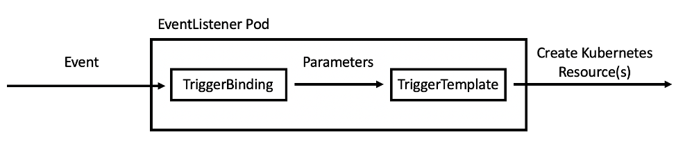

Alberto Losada, Sergi Jiménez

# Building CNF applications with OpenShift Pipelines

# Introduction

You've probably heard about the fifth-generation technology standard for cellular networks (5G) or edge computing, and the potential to change the world and affect our lives. This new technology will support billions of devices with almost no latency at speeds around 20 times faster than its predecessor. Now, think about the Internet of Things (IoT), Telemedicine, Virtual Reality (VR), Autonomous Cars, Faster Gaming... Apologies for interrupting, but let's put aside for a moment our imagination and dig into the technology required to satisfy our dreams.

All of these technologies and applications often demand very high-performance requirements for both throughput, latency, and efficiency. This means that a compilation of multiple features is required for adequate utilization of the underlying platform capabilities when deploying **deterministic** applications. Some examples of these required network features are [Multus CNI](https://github.com/intel/multus-cni), [SR-IOV](https://en.wikipedia.org/wiki/Single-root_input/output_virtualization) and [Data Plane Development Kit (DPDK)](https://www.dpdk.org/). They are elements of what is called **Containerized Network Functions** or **Cloud-native Network Functions** (CNFs).

## Containerized Network Functions

Before talking about CNFs, it is important to first understand [Network Functions Virtualization (NFV)](https://en.wikipedia.org/wiki/Network_function_virtualization). NFV replaces network hardware appliances with software, including **Virtual Network Functions** (VNFs), that run on **virtual machines** (VMs) running on commodity hardware. CNFs are similar to VNFs, but they run on lighter-weight containers on top of Kubernetes, providing greater agility and ease of deployment compared with VMs. While VNFs are software forms of network appliances such as routers, firewalls, load-balancers, etc. deployed as one or more VMs, CNFs are just the containerized network functions.

In a generic Kubernetes application, the single networking interface provided by a Pod (eth0) is sufficient for most purposes. It even can be extended using CNI plugins available. However, in cases where low latency and high network performance is a must, we need a way of providing additional network interfaces to the Pod which has direct access to the hardware (NIC). Then, the application can communicate with the hardware which delivers these high capacities outside of the standard Kubernetes networking. This is why we start talking about CNFs and ways to accelerate them.

In the OpenShift blog, we already presented and ["demystified" Multus](https://www.openshift.com/blog/demystifying-multus) by showing their deep relation with SR-IOV technology when dealing with high-performance networking workloads. **Multus** enables our application to attach to a virtual function (VF) interface presented by an SR-IOV capable NIC on the OpenShift node. This permit us to achieve near-native networking performance. The [SR-IOV Operator](https://docs.openshift.com/container-platform/4.5/networking/hardware_networks/about-sriov.html) became GA on OpenShift 4.3, so information on how to [install](https://docs.openshift.com/container-platform/4.5/networking/hardware_networks/installing-sriov-operator.html) and [configure](https://docs.openshift.com/container-platform/4.5/networking/hardware_networks/configuring-sriov-operator.html) it can be found in the official documentation.


## Data Plane Development Kit (DPDK)

The third component we already mentioned is [DPDK](https://www.dpdk.org/). DPDK is a set of libraries and drivers for Linux and BSD built to accelerate packet processing workloads designed to run on x86, POWER and ARM processors. DPDK offers offloading TCP packet processing from the operating system Kernel space to process them in the User space to obtain a high performant and deterministic system.

DPDK libraries offer to free up the Kernel space from interrupts by processing the work in User space instead. This is possible thanks to the DPDK libraries and the DPDK poll mode driver (PMD). This driver is responsible for the communication between the application and network card, listening in a loop avoiding as much as possible interrupts while forwarding packets. The diagram from [1](#References) streamlines the idea:


In OpenShift 4.5, as _Technology Preview_, it is possible to use the DPDK libraries and attach a network interface (SR-IOV virtual function) directly to the Pod. To ease the application building process, we can leverage Red Hat's [DPDK builder image](https://catalog.redhat.com/software/containers/openshift4/dpdk-base-rhel8/5e32be6cdd19c77896004a41?container-tabs=overview) available from Red Hat's official registry. This base or builder image is intended to build applications powered by DPDK and also work with multiple CNI plugins.

> :exclamation: At the time of writing DPDK base image is running DPDK version 18.11.2. This [DPDK RHEL8 base image](https://catalog.redhat.com/software/containers/openshift4/dpdk-base-rhel8/5e32be6cdd19c77896004a41?container-tabs=dockerfile) is built and maintained by Red Hat and based on the [Universal Base Image 8](https://access.redhat.com/articles/4238681).

# Scenario

_The goal is to create an automated pipeline to get the code, build it using Red Hat's DPDK base image, and deploy the CNF application in a multi-cluster environment_.

In this task, a **continuous deployment** (CD) process driven by cloud-native CI/CD on OpenShift called [OpenShift Pipelines](https://docs.openshift.com/container-platform/4.5/pipelines/understanding-openshift-pipelines.html) will assist us. As an example application that requires DPDK libraries and Multus/SR-IOV, we are going to build [testPMD](https://doc.dpdk.org/guides/testpmd_app_ug/). TestPMD is an application used to test DPDK in a packet forwarding mode and also to access NIC hardware features such as Flow Director. 

> :exclamation: testPMD is only provided as a simple example of how to build a more fully-featured application using the DPDK base image.


The pipeline will be in charge of:

* Starting the pipeline every time code is pushed into the master branch of the testPMD Git repository.
* Pulling testPMD source code from the Git repository where the webhook was triggered.
* Pulling the DPDK base image from Red Hat's catalog image registry.
* Building the application using [Source-to-Image (S2I)](https://github.com/openshift/source-to-image) strategy.
* Pushing the resulting image to a container public registry such as [Quay.io](https://quay.io). 
* Automatically deploying the new version of the application into the proper project running in another cluster, the CNF OpenShift cluster.


# Environment

To create the containerized application, we require:

* An OpenShift Container Platform 4.5 cluster where the application is built. This cluster will be called _Development cluster_.
* [OpenShift Pipelines](https://www.openshift.com/learn/topics/pipelines) based on [Tekton](https://tekton.dev/) installed as the CI/CD tool. OpenShift Pipelines Operator v1.0.1 is available to install from OpenShift's OperatorHub.
* Demo files:
  * [Demo Repository](https://github.com/alosadagrande/tekton-dpdk)
  * [Tekton Files](https://github.com/alosadagrande/tekton-dpdk/tree/master/resources)
  * [testPMD application source code](https://github.com/alosadagrande/testpmd)

If you are just planning to automate the application building process, the prior requirements will suffice. 

In the event you also plan to deploy the built application, you need to be aware that DPDK requires huge pages along with SR-IOV configuration properly enabled. Observe that SR-IOV supported devices are required. In that case, you need as well:

* An OpenShift Container Platform 4.5 cluster, which we call _CNF cluster_, where the application is deployed.

> :warning: Notice that it is not mandatory to deploy the application in another cluster, but in our multi-cluster scenario, there is a separation between the Development cluster and the CNF or production cluster. 

* Huge pages configured within the node where the application is deployed. A detailed procedure can be found in [Configuring huge pages](https://docs.openshift.com/container-platform/4.5/scalability_and_performance/what-huge-pages-do-and-how-they-are-consumed-by-apps.html).
* An SR-IOV capable node inside the CNF OpenShift cluster. In our environment, we have a node with several Mellanox MT27800 Family [ConnectX-5] 25GbE dual-port SFP28 Network Interface Cards (NICs). Take a look at [this table](https://docs.openshift.com/container-platform/4.5/networking/hardware_networks/about-sriov.html) with all the supported SR-IOV NIC models.
* [SR-IOV Nework operator](https://docs.openshift.com/container-platform/4.5/networking/hardware_networks/installing-sriov-operator.html) installed and running successfully. SR-IOV devices must be properly detected and configured.

> :exclamation: If you do not have an SR-IOV supported device, you still can run the OpenShift pipeline and build the example CNF application. 


## CNF cluster configuration

This cluster is configured to run DPDK and SR-IOV workloads. It is also going to run every new release of the testPMD application pushed successfully to Quay.io container image registry. On the hardware side, it has a couple of SR-IOV capable nodes and configured using the SR-IOV operator. Huge pages and other performance profiles have been already applied. So it is ready, to run CNF workloads. 

Since it is going to run the CNF application, let's create the project where all required OpenShift objects are placed:

```sh
$ oc new-project deploy-testpmd
Using project "deploy-testpmd" on server "https://api.cnf10.kni.lab.eng.bos.redhat.com:6443".
```

> :exclamation: Project is created into the CNF OpenShift cluster (api.cnf10.)

Next, create the testPMD deployment object ([deployment-testpmd.yaml](https://github.com/alosadagrande/tekton-dpdk/blob/master/resources/cnf-cluster/deployment-testpmd.yaml)). Notice that the application requests a guaranteed amount of CPU, memory and huge pages. Also, the Pod requires an additional network interface pinned to the SR-IOV VFS provided by the node (k8s.v1.cni.cncf.io/networks: deploy-testpmd/sriov-network).

>:warning: Replace the additional network annotation with the name of your SR-IOV network attach definition if you have a capable cluster.

Whenever a new image is pushed to Quay.io, the pipeline executed in the Development cluster is in charge of rolling out a new version of the application in the CNF cluster. Consequently, we need to provide authentication and authorization to deploy it. A service account called _robot_ in `deploy-testpmd` namespace with the proper permissions must be created. These credentials are only used by the pipeline task to authenticate to the CNF cluster and roll out a new version of testPMD.

```sh
$ oc create sa robot -n deploy-testpmd
serviceaccount/robot created

$ oc adm policy add-role-to-user admin -z robot
clusterrole.rbac.authorization.k8s.io/admin added: "robot"
```
Robot's credentials must be extracted as they will be needed when creating the pipeline.

```sh
$ export TOKEN=$(oc serviceaccounts get-token robot -n deploy-testpmd)
```

## Development cluster configuration

This cluster is in charge of running the CNF application pipeline. It can be seen as an OpenShift cluster focused on development, _a central point where all the different teams within a company create and configure their automated builds, deployments or pipelines in general_.

OpenShift Pipelines Operator can be easily installed from the OperatorHub. So we can start by creating a project called `dpdk-build-testpmd` where the continuous deployment (CD) pipeline will be executed.

```sh
$ oc new-project dpdk-build-testpmd
Now using project "dpdk-build-testpmd" on server "https://api.cnf20.cloud.lab.eng.bos.redhat.com:6443"
```

>:exclamation: Project is created into the Development OpenShift cluster (api.cnf20.)

Now, it is time to tell OpenShift how to deal with the different container registries involved in our deployment. Red Hat's registry is required to pull the DPDK base image while Quay.io is used to store the resulting image. Both [requires authentication](https://access.redhat.com/RegistryAuthentication) to be configured. Create and import a secret type `dockerconfigjson` into our project with the appropiate credentials:

```sh
$ podman login --authfile auth.json quay.io
Username: alosadag
Password: *******
Login Succeeded!

$ podman login --authfile auth.json registry.redhat.io
Username: alosadag
Password: ******
Login Succeeded!

$ oc create secret generic secret-registries --from-file=.dockerconfigjson=auth.json  --type=kubernetes.io/dockerconfigjson
secret/secret-registries created
```
Finally, link the secret with the **pipeline** service account, which, by default, is responsible to run our pipeline. You will notice that it is already created.

```sh
$ oc secret link pipeline secret-registries
```

# OpenShift Pipelines (Tekton)

OpenShift Pipelines is a powerful tool for building continuous delivery pipelines using modern infrastructure. The core component runs as a controller in OpenShift. It registers several custom resource definitions (CRDs) which represent the basic Tekton objects with the Kubernetes API server, so the cluster knows to delegate requests containing those objects to Tekton. These primitives are fundamental to the way Tekton works, once you have OpenShift Pipelines Operator installed you can list them:

```sh
oc get crd | grep tekton | awk '{print $1}'
clustertasks.tekton.dev
clustertriggerbindings.triggers.tekton.dev
conditions.tekton.dev
config.operator.tekton.dev
eventlisteners.triggers.tekton.dev
pipelineresources.tekton.dev
pipelineruns.tekton.dev
pipelines.tekton.dev
taskruns.tekton.dev
tasks.tekton.dev
triggerbindings.triggers.tekton.dev
triggertemplates.triggers.tekton.dev
```

[Tekton Pipelines project](https://tekton.dev/) recently **released its Beta**, which creates higher levels of stability and creates more trust between the users and the features. With the new Beta functionality, users can rest assured that Beta features will not be removed. The move to Beta does also mean _a few deprecations and breaking changes_. 

Currently, there is an ongoing effort migrating [Tekton from `v1alpha1` to Tekton `v1beta1` API version](https://github.com/tektoncd/pipeline/blob/master/docs/migrating-v1alpha1-to-v1beta1.md) which encourages stop using `PipelineResources` in favor of `Tasks`. Even though `PipelineResources` will not make it to Beta as [explained officially](https://github.com/tektoncd/pipeline/blob/master/docs/resources.md#why-arent-pipelineresources-in-beta), they are still supported in OpenShift Pipelines version 1.0.1. On the other hand, since they will probably be deprecated at some point, I prefer to replace them by `Tasks` as suggested by Tekton team, which already provided a [documented migration path](https://github.com/tektoncd/pipeline/blob/master/docs/migrating-v1alpha1-to-v1beta1.md#replacing-pipelineresources-with-tasks). 

>:exclamation: The pipeline we are about to create makes use of the `v1beta1` Tekton API guaranteeing long term compliance.


## Pipeline Tasks

A `Task` is a collection of Steps that you define in a specific order as part of your pipeline. OpenShift comes by default with a bunch of `ClusterTasks` predefined, which are similar to Tekton `Tasks` but with a cluster scope. Below it is the list of them currently shipped:

```sh
$ oc get clustertask -o name
clustertask.tekton.dev/buildah
clustertask.tekton.dev/buildah-v0-11-3
clustertask.tekton.dev/git-clone
clustertask.tekton.dev/jib-maven
clustertask.tekton.dev/kn
clustertask.tekton.dev/maven
clustertask.tekton.dev/openshift-client
clustertask.tekton.dev/openshift-client-v0-11-3
clustertask.tekton.dev/s2i
clustertask.tekton.dev/s2i-dotnet-3
clustertask.tekton.dev/s2i-dotnet-3-v0-11-3
clustertask.tekton.dev/s2i-go
clustertask.tekton.dev/s2i-go-v0-11-3
clustertask.tekton.dev/s2i-java-11
clustertask.tekton.dev/s2i-java-11-v0-11-3
clustertask.tekton.dev/s2i-java-8
clustertask.tekton.dev/s2i-java-8-v0-11-3
clustertask.tekton.dev/s2i-nodejs
clustertask.tekton.dev/s2i-nodejs-v0-11-3
clustertask.tekton.dev/s2i-perl
clustertask.tekton.dev/s2i-perl-v0-11-3
clustertask.tekton.dev/s2i-php
clustertask.tekton.dev/s2i-php-v0-11-3
clustertask.tekton.dev/s2i-python-3
clustertask.tekton.dev/s2i-python-3-v0-11-3
clustertask.tekton.dev/s2i-ruby
clustertask.tekton.dev/s2i-ruby-v0-11-3
clustertask.tekton.dev/s2i-v0-11-3
clustertask.tekton.dev/tkn
```

To start our pipeline, first, we need to pull the testPMD source code from the Git repository. Towards that goal, the [git-clone ClusterTask](https://github.com/tektoncd/catalog/tree/master/task/git-clone/0.1) comes very handy. A copy is available at [pipeline-clustertask-git-clone.yaml](https://github.com/alosadagrande/tekton-dpdk/blob/master/resources/tekton-pipeline/pipeline-clustertask-git-clone.yaml).

**Git-clone** `ClusterTask` requires a [Workspace](https://github.com/tektoncd/pipeline/blob/master/docs/workspaces.md) backed up by a Persistent Volume (PV) so that the code pulled is stored and then shared among all the tasks that are part of the pipeline. As a result, a Persistent Volume Claim (PVC) similar to [pipeline-pvc-testpmd.yaml](https://github.com/alosadagrande/tekton-dpdk/blob/beta/resources/tekton-pipeline/pipeline-pvc-testpmd.yaml) must be created in the _dpdk-build-testpmd_ namespace.

```yaml
apiVersion: v1
kind: PersistentVolumeClaim
metadata:
  labels:
    name: pvc-testpmd
  name: pvc-testpmd
spec:
  accessModes:
  - ReadWriteOnce
  resources:
    requests:
      storage: 1Gi
```

Next, a **Source to Image** ([S2I](https://github.com/tektoncd/catalog/tree/master/task/s2i/0.1)) task is needed to build testPMD application along with DPDK builder image. Although there is a S2I `ClusterTask` already available in OpenShift, it makes use of `PipelineResources`. An adapted version of the shipped S2I called _s2i-cnf_ is created and available in [pipeline-task-s2i.yaml](https://github.com/alosadagrande/tekton-dpdk/blob/master/resources/tekton-pipeline/pipeline-task-s2i.yaml). This new task uses `Workspaces` instead of resources.

```sh
$ oc create -f pipeline-task-s2i.yaml -n dpdk-build-testpmd
task.tekton.dev/s2i-cnf created
```

At this point, a testPMD container image should be already created and uploaded to the Quay.io container image registry. Then, it is time to set up a task that permits authenticate into the CNF cluster and roll out a new version of the application. Previously to Beta release, a _cluster type_ `PipelineResource` was probably the best option. But, now a _kubeconfig-creator_ `Task` is recommended in the [Migrating v1alpha1 to v1beta1](https://github.com/tektoncd/pipeline/blob/master/docs/migrating-v1alpha1-to-v1beta1.md#replacing-a-cluster-resource) documentation. It fundamentally uses the shared `Workspace` to save a valid Kubeconfig file that can be leveraged by the following task to log into the CNF cluster.

```sh
$ oc create -f pipeline-task-kubeconfig-creator.yaml -n dpdk-build-testpmd 
task.tekton.dev/kubeconfig-creator created
```

The last task, defined in [pipeline-task-oc-client-remote.yaml](https://github.com/alosadagrande/tekton-dpdk/blob/master/resources/tekton-pipeline/pipeline-task-oc-client-remote.yaml) deploys the new image into the CNF cluster. It is also a custom task based in the [openshift client](https://github.com/tektoncd/catalog/tree/master/task/openshift-client/0.1) `ClusterTask` available in OpenShift. It consumes the Kubeconfig file created previously in the shared `Workspace` to authenticate to the remote cluster as the robot service account and force a new `Deployment`.

```sh
$ oc create -f  pipeline-task-oc-client-remote.yaml -n dpdk-build-testpmd
task.tekton.dev/openshift-client-cluster created
```

Once all the `Tasks` are imported, it is time to create the `Pipeline` object that includes all of them in a single workflow. As they can be reviewed in [pipeline-dpdk-testpmd.yaml](https://github.com/alosadagrande/tekton-dpdk/blob/master/resources/tekton-pipeline/pipeline-dpdk-testpmd.yaml), the four `Tasks` already detailed are referenced in the _spec_ field. 

> :exclamation: A considerable amount of parameters are defined inside the tasks, making the pipeline more re-usable. It makes possible to build completely different applications or execute specific oc commands.

```yaml
apiVersion: tekton.dev/v1beta1
kind: Pipeline
metadata:
  name: dpdk-build-testpmd
  namespace: dpdk-build-testpmd
spec:
  params:
  - name: git-url
  - name: git-revision
  - name: image-name
  - name: path-to-image-context
  - name: path-to-dockerfile
  - name: auth-token
  - name: auth-username
  - name: auth-url
  - name: auth-name
  - name: auth-namespace
  - name: builder-image
  - name: git-sslverify
  - name: oc-args
  workspaces:
  - name: git-source
  tasks:
  - name: fetch-from-git
    taskRef:
      kind: ClusterTask
      name: git-clone
    params:
    - name: url
      value: $(params.git-url)
    - name: revision
      value: $(params.git-revision)
    - name: deleteExisting
      value: "true"
    - name: sslVerify
      value: $(params.git-sslverify)
    workspaces:
    - name: output
      workspace: git-source
  - name: build-testpmd
    params:
    - name: BUILDER_IMAGE
      value: $(params.builder-image)
    - name: PATH_CONTEXT
      value: . 
    - name: TLSVERIFY
      value: "false"
    - name: LOGLEVEL
      value: "1"
    - name: IMAGE_URL
      value: $(params.image-name)
    workspaces:
    - name: source
      workspace: git-source
    taskRef:
      name: s2i-cnf
    runAfter:
    - fetch-from-git
  - name: create-kubeconfig
    params:
    - name: name
      value: $(params.auth-name)
    - name: username
      value: $(params.auth-username)
    - name: url
      value: $(params.auth-url)
    - name: token
      value: $(params.auth-token)
    - name: insecure
      value: "true"
    - name: namespace
      value: $(params.auth-namespace)
    taskRef:
      name: kubeconfig-creator
    workspaces:
    - name: output
      workspace: git-source
    runAfter:
    - build-testpmd
  - name: deploy-testpmd
    params:
    - name: SCRIPT
      value: oc $@
    - name: ARGS
      value:
      - $(params.oc-args)
    - name: NAMESPACE
      value: $(params.auth-namespace)
    - name: FILENAME 
      value: kubeconfig
    runAfter:
    - create-kubeconfig 
    taskRef:
      kind: Task
      name: openshift-client-cluster
    workspaces:
    - name: kube
      workspace: git-source
```

Import the `Pipeline` in the right namespace and verify the status by checking the OpenShift web console:

```sh
$ oc create -f pipeline-dpdk-testpmd.yaml -n dpdk-build-testpmd
pipeline.tekton.dev/dpdk-build-testpmd created
```


A pretty good description of the pipeline components can be shown using the [Tekton CLI (tkn)](https://github.com/tektoncd/cli):

```sh
$ tkn pipeline describe dpdk-build-testpmd
Name:        dpdk-build-testpmd
Namespace:   dpdk-build-testpmd

📦 Resources

 No resources

⚓ Params

 NAME                      TYPE     DESCRIPTION   DEFAULT VALUE
 ∙ git-url                 string                 ---
 ∙ git-revision            string                 ---
 ∙ image-name              string                 ---
 ∙ path-to-image-context   string                 ---
 ∙ path-to-dockerfile      string                 ---
 ∙ auth-token              string                 ---
 ∙ auth-username           string                 ---
 ∙ auth-url                string                 ---
 ∙ auth-name               string                 ---
 ∙ auth-namespace          string                 ---
 ∙ builder-image           string                 ---

🗒  Tasks

 NAME                  TASKREF                    RUNAFTER
 ∙ fetch-from-git      git-clone                  
 ∙ build-testpmd       s2i-cnf                    fetch-from-git
 ∙ create-kubeconfig   kubeconfig-creator         build-testpmd
 ∙ deploy-testpmd      openshift-client-cluster   create-kubeconfig

⛩  PipelineRuns
```

> :exclamation: Notice that there are no _resources_ (`PipelineResources`) in our pipeline. So, their functionality has been migrated to `Tasks` and we are in line with Tekton Pipelines Beta recommendations.


## Adding Triggers to the Pipeline

At this point, you may be able to create a `PipelineRun` ([pipelinerun-dpdk-testpmd.yaml](https://github.com/alosadagrande/tekton-dpdk/blob/master/resources/tekton-pipeline/pipelinerun-dpdk-testpmd.yaml)) and execute the workflow defined. 

>:exclamation: Replace the values of the params with your environment configuration. Remember to include robot's authentication [TOKEN](#cnf-cluster-configuration).

```sh
$ oc create -f pipelinerun-dpdk-testpmd.yaml 
pipelinerun.tekton.dev/dpdk-build-testpmd-ws-run-dxq94created

$ tkn pr logs -f dpdk-build-testpmd-ws-run-dxq94
Pipelinerun started: dpdk-build-testpmd-ws-run-dxq94
Waiting for logs to be available...
[fetch-from-git : clone] + CHECKOUT_DIR=/workspace/output/
[fetch-from-git : clone] + '[[' true '==' true ]]
[fetch-from-git : clone] + cleandir
[fetch-from-git : clone] + '[[' -d /workspace/output/ ]]
[fetch-from-git : clone] + rm -rf /workspace/output//README.md /workspace/output//build.sh /workspace/output//kubeconfig /workspace/output//run.sh /workspace/output//test-pmd /workspace/output//test-template.sh
[fetch-from-git : clone] + test -z 
[fetch-from-git : clone] + /ko-app/git-init -url https://github.com/alosadagrande/testpmd.git -revision master -refspec  -path /workspace/output/ '-sslVerify=true' '-submodules=true' -depth 1
[fetch-from-git : clone] {"level":"info","ts":1595947048.1077354,"caller":"git/git.go:136","msg":"Successfully cloned https://github.com/alosadagrande/testpmd.git @ 1c419fd631152a2b81593ace2c7714fc8b6a19d4 (grafted, HEAD, origin/master) in path /workspace/output/"}
[fetch-from-git : clone] {"level":"info","ts":1595947048.1510515,"caller":"git/git.go:177","msg":"Successfully initialized and updated submodules in path /workspace/output/"}

[build-testpmd : generate] Running S2I version "unknown"
[build-testpmd : generate] Copying sources from "." to "/gen-source/upload/src"
[build-testpmd : generate] Application dockerfile generated in /gen-source/Dockerfile.gen

[build-testpmd : build] STEP 1: FROM registry.redhat.io/openshift4/dpdk-base-rhel8
[build-testpmd : build] Getting image source signatures
[build-testpmd : build] Copying blob sha256:a757589d62994e495d9a19fd0568eef9d50beabd29b25f5ef85566c7f03a6333
...
```

However, we want to provide a real continuous deployment pipeline. Then, as explained in [Scenario](#scenario), the pipeline must be automatically launched every time a new code is pushed to the master branch of testPMD Git repository. We assume that pushing code to the master branch means: it is ready for production. 

[Tekton Triggers](https://github.com/tektoncd/triggers) provides a mechanism to declaratively create `PipelineRuns` based on external events. They implement a system for creating Kubernetes resources in response to external events, mostly in the form of **webhooks**. These events allow users to create resource templates that get instantiated when an event is received. Additionally, fields from event payloads can be injected into these resource templates as runtime information. 

The Tekton Triggers project defines three main concepts (as Kubernetes CRDs). These are `TriggerBindings`, `TriggerTemplates`, and `EventListeners`. Below image, from [[2]](#References), depicts the interaction among them:



A `TriggerTemplate` defines a template for how a pipeline should be executed in reaction to events. When an event is received by our EventListener, the `TriggerTemplate` is rendered by extracting parameter values (eg: Git repository URL, revision, etc.) from the event payload. This will result in the creation of a new `PipelineRun`. As you can see in the [TriggerTemplate file](https://github.com/alosadagrande/tekton-dpdk/blob/master/resources/tekton-triggers/triggertemplate.yaml), all the parameters defined in the Pipeline ([pipeline-dpdk-testpmd.yaml](https://github.com/alosadagrande/tekton-dpdk/blob/master/resources/tekton-pipeline/pipeline-dpdk-testpmd.yaml)) are populated either from the event payload or from the `TriggerBinding` file. Create the object into the _dpdk-build-testpmd_:

```yaml
apiVersion: triggers.tekton.dev/v1alpha1
kind: TriggerTemplate
metadata:
  name: testpmd-build-and-deploy
spec:
  params:
  - name: GIT_URL
    description: The Git repository url.
  - name: REVISION
    description: The revision to build and deploy.
  - name: GIT_SSLVERIFY
    description: Validate Git certificate
  - name: SERVICE_ACCOUNT
    description: The ServiceAccount under which to run the Pipeline.
  - name: AUTH_TOKEN
    description: A valid authentication token from robot serviceaccount in DEPLOY_NAMESPACE
  - name: AUTH_URL
    description: URL of the cluster where the application is deployed
  - name: BUILDER_IMAGE
    description: Location of the builder image s2i
  - name: IMAGE_URL
    description: Full name of the built image
  - name: AUTH_NAME
    description: Name of the remote cluster
  - name: AUTH_USERNAME
    description: Username to authenticate to remote cluster
  - name: AUTH_NAMESPACE
    description: Default namespace in the remote cluster
  - name: PATH_TO_DOCKERFILE
  - name: PATH_TO_IMAGE_CONTEXT
  - name: OC_ARGS
    description: Remote oc commands applied
  resourcetemplates:
  - apiVersion: tekton.dev/v1beta1
    kind: PipelineRun
    metadata:
      generateName: dpdk-build-testpmd-run-
      namespace: dpdk-build-testpmd
    spec:
      pipelineRef:
        name: dpdk-build-testpmd
      params:
      - name: git-url
        value: $(params.GIT_URL)
      - name: git-revision
        value: $(params.REVISION)
      - name: git-sslverify
        value: $(params.GIT_SSLVERIFY)
      - name: builder-image
        value: $(params.BUILDER_IMAGE)
      - name: image-name
        value: $(params.IMAGE_URL)
      - name: auth-name
        value: $(params.AUTH_NAME)
      - name: auth-username
        value: $(params.AUTH_USERNAME)
      - name: auth-url
        value: $(params.AUTH_URL)
      - name: auth-token
        value: $(params.AUTH_TOKEN)
      - name: auth-namespace
        value: $(params.AUTH_NAMESPACE)
      - name: path-to-dockerfile
        value: $(params.PATH_TO_DOCKERFILE)
      - name: path-to-image-context
        value: $(params.PATH_TO_IMAGE_CONTEXT)
      - name: oc-args
        value: $(params.OC_ARGS)
      serviceAccountName: $(params.SERVICE_ACCOUNT)
      timeout: 1h0m0s
      workspaces:
        - name: git-source
          persistentVolumeClaim:
            claimName: pvc-testpmd
```

Next, apply the [TriggerBinding file](https://github.com/alosadagrande/tekton-dpdk/blob/master/resources/tekton-triggers/triggerbinding.yaml) which specifies the values to use for your TriggerTemplate’s parameters. The _GIT_URL_ and _REVISION_ parameters are especially important because they are extracted from the pull request event body. See [GitHub pull request event documentation](https://developer.github.com/v3/activity/events/types/#pullrequestevent) for more information.

The rest of the parameters in the `TriggerBinding` have hardcoded values because they do not come from the pull request event; these values are specific to the OpenShift environment.

> :exclamation: The authentication TOKEN and the remaining parameters must be replaced by the specific values in your environment.

```yaml
apiVersion: triggers.tekton.dev/v1alpha1
kind: TriggerBinding
metadata:
  name: testpmd-build-and-deploy
spec:
  params:
  - name: GIT_URL
    value: $(body.repository.git_http_url)
  - name: REVISION
    value: $(body.checkout_sha)
  - name: GIT_SSLVERIFY
    value: "false"
  - name: SERVICE_ACCOUNT
    value: "pipeline"
  - name: AUTH_NAME
    value: "cluster-cnf10"
  - name: AUTH_USERNAME
    value: "robot"
  - name: AUTH_URL
    value: 'https://api.cnf10.kni.lab.eng.bos.redhat.com:6443'
  - name: AUTH_TOKEN
    value: _ROBOT_SA_TOKEN_
  - name: AUTH_NAMESPACE
    value: "deploy-testpmd"
  - name: BUILDER_IMAGE
    value: 'registry.redhat.io/openshift4/dpdk-base-rhel8'
  - name: IMAGE_URL
    value: 'quay.io/alosadag/testpmd:tekton'
  - name: PATH_TO_IMAGE_CONTEXT
    value: ''
  - name: PATH_TO_DOCKERFILE
    value: ''
  - name: OC_ARGS
    value: 'replace -f https://raw.githubusercontent.com/alosadagrande/tekton-dpdk/beta/resources/cnf-cluster/deployment-testpmd.yaml --force'
```

The [EventListener file](https://github.com/alosadagrande/tekton-dpdk/blob/master/resources/tekton-triggers/eventlistener.yaml) defines a list of triggers. Each trigger pairs a `TriggerTemplate` with a number of `TriggerBindings`. Apply the file in _dpdk-build-testpmd_ namespace:

```yaml
apiVersion: triggers.tekton.dev/v1alpha1
kind: EventListener
metadata:
  name: testpmd
spec:
  serviceAccountName: pipeline
  triggers:
  - name: pullrequest-build-and-deploy
    template:
      name: testpmd-build-and-deploy
    bindings:
    - name: testpmd-build-and-deploy
```

Finally, create the proper RBAC configuration so that the `EventListener` Pod can read all Tekton Triggers resources so that it can know what to do with each event. The [RBAC](https://github.com/alosadagrande/tekton-dpdk/blob/master/resources/tekton-triggers/rbac.yaml) file assigns the Role to the `pipeline` service account.

A [Route](https://github.com/alosadagrande/tekton-dpdk/blob/master/resources/tekton-triggers/route.yaml) must be exposed as well, so that the remote Git repository can send events to our Development OpenShift cluster. Apply it in the proper namespace.

## Validation

Lastly, we must validate the CD pipeline. In this [video](https://www.youtube.com/watch?v=cx34XeLUJV8), it is shown how every change pushed into the master branch of testPMD repository starts our workflow. The pipeline finishes deploying automatically the last version of our CNF application into the remote cluster.

[](https://www.youtube.com/watch?v=cx34XeLUJV8 "Building Cloud-native Network Functions with OpenShift Pipelines")

## Summary

This article outlined how to build CNF applications leveraging cloud-native CI/CD tools like OpenShift Pipelines. The intent of this blog post was to demonstrate that applications that have high-performance networking requirements can be **deployed and built natively** in OpenShift Container Platform. 

OpenShift is moving fast to welcome on board deterministic and low latency applications, which are usual in the telco space. Concepts and technologies like _SR-IOV_, _Multus_, _DPDK_, _FPGA_, _GPU_, _huge pages_, _CPU isolation_, _NUMA affinity_, _Real-time kernel_... are already supported or they are in the process of being supported, currently as Developer or Technology Preview. Stay tuned for the forthcoming OpenShift releases!

On the other hand, if your workloads are not that specific in terms of network performance, OpenShift Pipelines based on Tekton can still be very helpful as a framework for creating your automated pipelines on top of your OpenShift cluster. In this article, we have built a CNF application using a DPDK base image, however, it will not be difficult to adapt the same pipeline to build a completely different application based on a different technology. Notice that the `Pipeline` and `TriggerTemplate` files defined were highly parametrized to facilitate the reusability. Now, it is your turn to adjust the ideas explained here to your special needs.  

## References

1. [Enhanced Platform Awareness (EPA) in OpenShift](https://medium.com/swlh/enhanced-platform-awareness-epa-in-openshift-part-iv-sr-iov-dpdk-and-rdma-1cc894c4b7d0) series of blog posts by Luis Arizmendi.
2. [Tekton Triggers 101](https://developer.ibm.com/tutorials/tekton-triggers-101/) by Brandon Walker.